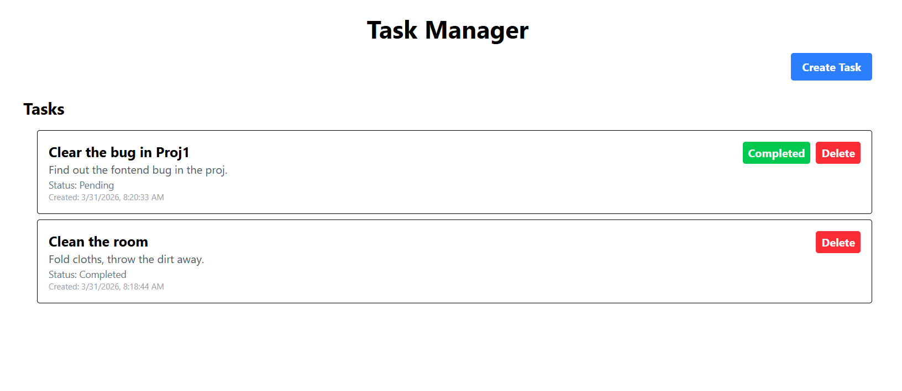
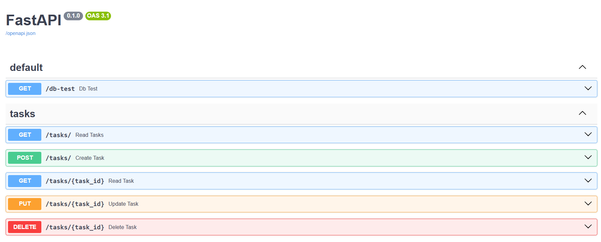

## Task Manager Application

### Overview
A task management application designed to create, track, and update their daily tasks efficiently.

### Features
- Create, read, update, and delete tasks
- Organize tasks by categories
- Mark tasks as complete
- Persistent data storage

## Setup Guide

### 1. Clone the repository
```
git clone https://github.com/Adarsh20082006/Task-Manager-App.git
```
### 2. Start the backend server
Create a .env file inside the backend/ folder:

```bash
DATABASE_PASSWORD=your_password
DATABASE_USER=user(example, root)
```
Then run the following commands:


```bash
cd backend
pip install -r requirements.txt
uvicorn main:app --reload
```

### 3. Run the frontend 

```
cd frontend
npm install
npm run dev
```
##### Access:

🖥️ **Frontend**: http://localhost:5173

⚙️ **Backend (Swagger Docs)**: http://localhost:8000/docs


---

### Technologies
- Frontend: React.js, Tailwind.css
- Backend: FastAPI
- Database: MySQL

### Screenshots



